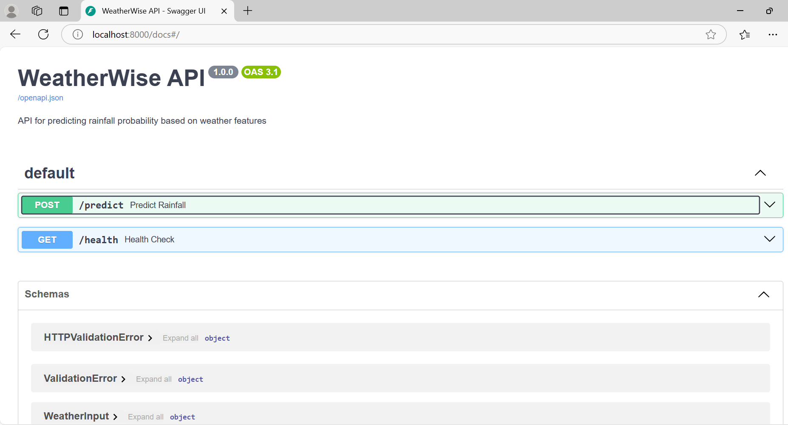

# WeatherWise: Automated Machine Learning Pipeline for Weather Prediction

**WeatherWise** is a comprehensive machine learning project designed to predict rainfall probability using a weather dataset. It integrates MLOps best practices, including **GitHub Actions** for CI/CD, **DVC** for data and model versioning, **FastAPI** for model deployment, and hyperparameter tuning for optimization. The project is structured to ensure reproducibility, scalability, and ease of deployment.

## Table of Contents
- [Features](#features)
- [Project Structure](#project-structure)
- [Prerequisites](#prerequisites)
- [Installation](#installation)
- [Data & ML Pipeline Versioning with DVC](#data--ml-pipeline-versioning-with-dvc)
- [Running the FastAPI Server](#running-the-fastapi-server)
- [Using Docker](#using-docker)
- [CI/CD](#cicd)
- [Testing](#testing)
- [Troubleshooting](#troubleshooting)
- [License](#license)

## Features
- **Rainfall Prediction**: Uses a trained Random Forest model to predict rainfall probability based on weather features.
- **MLOps Pipeline**:
  - Data versioning and pipeline management with DVC.
  - Automated CI/CD workflows using GitHub Actions.
  - Hyperparameter tuning for model optimization.
- **FastAPI Deployment**:
  - RESTful API with interactive Swagger UI at `http://localhost:8000/docs`.
  - Endpoints for health checks and predictions.
- **Containerization**: Docker support for consistent development and deployment.
- **Testing**: Unit tests for preprocessing and model components.
- **Reporting**: Generates metrics, confusion matrices, and ROC curves.

## Project Structure

```
WeatherWise/
├── .dvc/                       # DVC configuration and cache
├── .github/workflows/          # GitHub Actions CI/CD workflows
│   └── ci-cd.yml
├── config/                     # Configuration files
│   ├── config.yaml
│   └── hp_config.json          # Hyperparameter tuning settings
├── data/                       # Datasets
│   ├── raw/                    # Unprocessed data
│   │   └── weather.csv
│   └── processed/              # Preprocessed data
│       └── weather.csv
├── docs/                       # Documentation
│   ├── DVC_DRIVE.txt
│   ├── DVC_workflow_README.md
│   └── FastAPI_README.md
├── models/                     # Trained models
│   └── trained_model_random_forest.pkl
├── notebooks/                  # Jupyter notebooks for experimentation
├── reports/                    # Metrics and visualizations
│   ├── confusion_matrix.png
│   ├── hp_tuning_results.md
│   ├── metrics.json
│   ├── predictions.csv
│   ├── rfc_best_params.json
│   └── roc_curve.csv
├── scripts/                    # Automation scripts
│   ├── hp_tuning.py            # Hyperparameter tuning
│   └── metrics_and_plots.py    # Metrics and plot generation
├── src/                        # Source code
│   ├── api/                    # FastAPI application
│   │   └── app.py
│   ├── evaluation/             # Model evaluation
│   │   └── evaluate.py
│   ├── models/                 # Model definitions
│   │   └── model.py
│   ├── preprocessing/          # Data preprocessing
│   │   └── preprocess.py
│   ├── training/               # Model training
│   │   └── train.py
│   └── utils/                  # Utility functions
│       └── utils_and_constants.py
├── tests/                      # Unit tests
│   ├── test_model.py
│   └── test_preprocessing.py
├── .dvcignore
├── .env                        # Environment variables
├── .gitignore
├── activate_ml_env.sh          # Script to activate virtual environment
├── docker-compose.yml          # Docker Compose configuration
├── Dockerfile                  # Docker configuration
├── dvc.lock                    # DVC pipeline lock file
├── dvc.yaml                    # DVC pipeline definitions
├── main.py                     # FastAPI server entry point
├── requirements.txt            # Python dependencies
├── setup_weatherwise.sh        # Setup script
└── README.md                   # This file
```

## Prerequisites
- **Python**: 3.8 or higher
- **Git**: For cloning and version control
- **DVC**: For data and model versioning
- **Docker**: Optional, for containerized deployment
- **GitHub Account**: For CI/CD and optional DagsHub integration
- **Dependencies**: Listed in `requirements.txt` (e.g., `fastapi`, `uvicorn`, `pandas`, `joblib`, `pytest`, `dvc`)

## Installation
1. **Clone the Repository**:
   ```bash
   git clone https://github.com/kanhaiya-gupta/WeatherWise.git
   cd WeatherWise
   ```

2. **Set Up a Virtual Environment** (recommended):
   ```bash
   python -m venv venv
   source venv/bin/activate  # On Windows: venv\Scripts\activate
   ```
   Alternatively, use the provided script:
   ```bash
   bash activate_ml_env.sh
   ```

3. **Install Dependencies**:
   ```bash
   pip install -r requirements.txt
   ```

4. **Set Up Environment Variables** (optional):
   - Create a `.env` file or modify the existing one to include paths like `MODEL_PATH` if needed.
   - Example:
     ```
     MODEL_PATH=models/trained_model_random_forest.pkl
     ```

5. **Run Setup Script** (optional):
   ```bash
   bash setup_weatherwise.sh
   ```
   This script can automate environment setup if provided in the repository.

## Data & ML Pipeline Versioning with DVC
DVC is used to version datasets, models, and manage reproducible ML pipelines.

### Step-by-Step DVC Setup
1. **Initialize DVC**:
   ```bash
   dvc init
   git add .dvc .dvcignore
   git commit -m "Initialize DVC"
   ```

2. **Track Data**:
   Add the raw dataset:
   ```bash
   dvc add data/raw/weather.csv
   git add data/raw/weather.csv.dvc .gitignore
   git commit -m "Track raw dataset with DVC"
   ```

3. **Set Up Remote Storage** (e.g., DagsHub):
   ```bash
   dvc remote add -d origin https://dagshub.com/kanhaiya-gupta/WeatherWise.dvc
   dvc remote modify origin --local auth basic
   dvc remote modify origin --local user kanhaiya-gupta
   dvc remote modify origin --local password <your_dagshub_token>
   ```
   Push data to remote:
   ```bash
   dvc push
   ```

4. **Run the DVC Pipeline**:
   The `dvc.yaml` defines stages for preprocessing, training, and evaluation. Run:
   ```bash
   dvc repro
   ```
   This executes the pipeline, generating processed data, trained models, and reports.

5. **Push Updates**:
   ```bash
   dvc push
   git add dvc.yaml dvc.lock
   git commit -m "Update DVC pipeline"
   git push
   ```

6. **Visualize Pipeline**:
   ```bash
   dvc dag
   ```

### Key DVC Commands
| Task                   | Command                          |
|------------------------|----------------------------------|
| Initialize DVC         | `dvc init`                       |
| Track data             | `dvc add <path>`                 |
| Add remote storage     | `dvc remote add -d origin <url>` |
| Push data              | `dvc push`                       |
| Pull data              | `dvc pull`                       |
| Run pipeline           | `dvc repro`                      |
| Visualize pipeline     | `dvc dag`                        |

## Running the FastAPI Server
1. **Ensure Model Availability**:
   - Verify `models/trained_model_random_forest.pkl` exists.
   - If missing, run the DVC pipeline:
     ```bash
     dvc repro
     ```

2. **Start the Server**:
   ```bash
   python main.py
   ```
   This starts the FastAPI server on `http://localhost:8000` with auto-reload for development.

3. **Access the API**:
   - Open `http://localhost:8000/docs` for interactive Swagger UI.
   - Use tools like `curl` or Postman for API calls.
     


### API Endpoints
- **GET `/health`**:
  - **Description**: Check API and model status.
  - **Response**:
    ```json
    {"status": "healthy", "model_loaded": true}
    ```
  - **Example**:
    ```bash
    curl http://localhost:8000/health
    ```

- **POST `/predict`**:
  - **Description**: Predict rainfall probability.
  - **Request Body** (JSON):
    ```json
    {
                    "Location": 0.543,
                    "MinTemp": 13.4,
                    "MaxTemp": 22.9,
                    "Rainfall": 0.6,
                    "Evaporation": 4.5,
                    "Sunshine": 6.7,
                    "WindGustDir": 0.61,
                    "WindGustSpeed": 44.0,
                    "WindDir9am": 0.48,
                    "WindDir3pm": 0.55,
                    "WindSpeed9am": 20.0,
                    "WindSpeed3pm": 24.0,
                    "Humidity9am": 71.0,
                    "Humidity3pm": 22.0,
                    "Pressure9am": 1007.7,
                    "Pressure3pm": 1007.1,
                    "Cloud9am": 8.0,
                    "Cloud3pm": 5.0,
                    "Temp9am": 16.9,
                    "Temp3pm": 21.8,
                    "RainToday": 0,
                    "RISK_MM": 0.0
                }
    ```
  - **Response**:
    ```json
    {"rain_probability": 0.8534}
    ```
  - **Example**:
    ```bash
    curl -X POST "http://localhost:8000/predict" \
         -H "Content-Type: application/json" \
         -d '{ "Location": 0.543, "MinTemp": 13.4, "MaxTemp": 22.9, "Rainfall": 0.6, "Evaporation": 4.5, "Sunshine": 6.7, "WindGustDir": 0.61, "WindGustSpeed": 44.0,
                "WindDir9am": 0.48, "WindDir3pm": 0.55, "WindSpeed9am": 20.0, "WindSpeed3pm": 24.0, "Humidity9am": 71.0, "Humidity3pm": 22.0, "Pressure9am": 1007.7,
                "Pressure3pm": 1007.1, "Cloud9am": 8.0, "Cloud3pm": 5.0, "Temp9am": 16.9, "Temp3pm": 21.8, "RainToday": 0, "RISK_MM": 0.0
            }'
    ```

## Using Docker
1. **Build and Run**:
   ```bash
   docker-compose up --build
   ```
   The API will be available at `http://localhost:8000`.

2. **Stop Containers**:
   ```bash
   docker-compose down
   ```

## CI/CD
GitHub Actions automates the CI/CD pipeline (see `.github/workflows/ci-cd.yml`). On push or pull request to the `main` branch:
- **Linting**: Runs checks on source code.
- **Testing**: Executes `pytest` on unit tests.
- **Training**: Runs the DVC pipeline for preprocessing, training, and evaluation.
- **Deployment**: Builds and pushes a Docker image to DockerHub (requires `DOCKER_USERNAME` and `DOCKER_PASSWORD` secrets).

## Testing
Run unit tests for preprocessing and model components:
```bash
pytest tests/
```

## Troubleshooting
- **DVC Issues**:
  - **Data Not Found**: Run `dvc pull` to fetch data from remote.
  - **Pipeline Errors**: Check `dvc.yaml` for correct paths and dependencies.
- **Model Not Found**:
  - Ensure `models/trained_model_random_forest.pkl` exists.
  - Verify `MODEL_PATH` in `.env` or `src/api/app.py`.
- **Port Conflicts**:
  - Change the port in `main.py` (e.g., `port=8001`) if `8000` is in use.
- **Dependency Errors**:
  - Run `pip install -r requirements.txt` again.
  - Check `pip list` for missing packages.
- **API Errors**:
  - Validate input JSON against the `WeatherInput` schema.
  - Review server logs for details.

## License
This project is licensed under the MIT License. See the [LICENSE](LICENSE) file for details.
